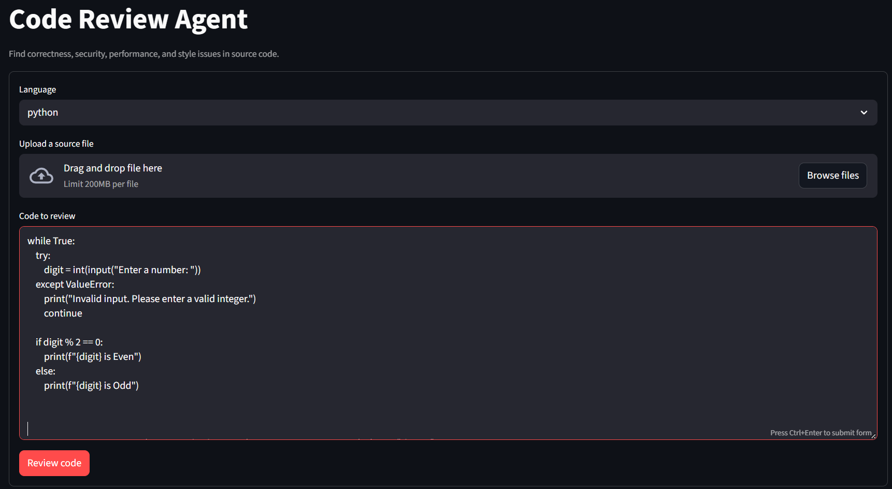
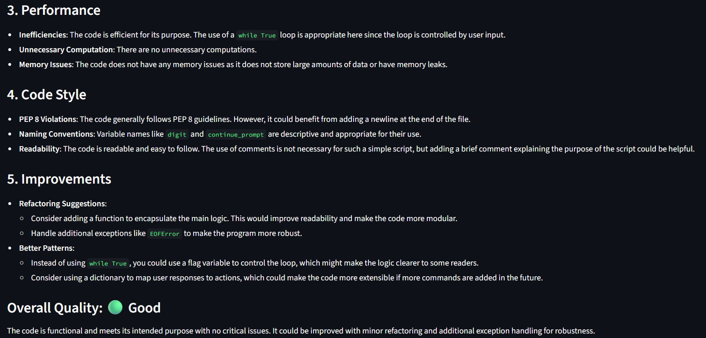

 # Code Review Agent

 An AI-powered code review tool that analyzes source code for correctness,
 security, performance, style, and maintainability issues. It supports both a
 command-line workflow and a Streamlit web interface.

 ## Architecture

 The application keeps the review logic in `agent.py` so both interfaces use the
 same behavior.

 ```mermaid
 flowchart TD
		 User[User] --> Entry{Entry point}
		 Entry --> CLI[agent.py CLI]
		 Entry --> UI[app.py Streamlit UI]
		 CLI --> Loader[Input validation and file loader]
		 UI --> Loader
		 Loader --> Prompt[Build review messages]
		 Prompt --> Model[OpenAI ChatOpenAI]
		 Model --> Report[Markdown review report]
		 Report --> CLIOutput[Terminal output]
		 Report --> UIOutput[Streamlit output]
 ```

 ### Core modules

 - `agent.py` contains the reusable review service:
	 - `validate_code()` rejects empty or oversized input.
	 - `read_code_file()` reads UTF-8 source files safely.
	 - `build_review_messages()` creates the structured model prompt.
	 - `create_reviewer()` creates the configured OpenAI chat model.
	 - `review_code()` validates input, calls the model, and returns Markdown.
	 - `main()` provides the CLI.
 - `app.py` provides the Streamlit interface. It accepts pasted code or a
	 UTF-8 file upload and delegates the actual review to `review_code()`.

 ## Screenshots

 ### Code review input

 The Streamlit page lets users select a language, upload a source file, or
 paste code directly into the editor before submitting a review.

 

 ### Generated review

 The result is rendered as a Markdown report with performance, style,
 improvement, and overall-quality sections.

 

 ## Review categories

 The model is instructed to report:

 1. Bugs and correctness issues
 2. Security risks, including unsafe operations and secret exposure
 3. Performance and memory concerns
 4. Code style and readability problems
 5. Practical improvements and refactoring suggestions

 The response is formatted as Markdown and includes an overall rating:
 `Good`, `Needs Work`, or `Critical Issues`.

 ## Requirements

 - Python 3.10 or newer
 - An OpenAI API key

 Create a `.env` file in this directory using `.env.example` as a template:

 ```env
 OPENAI_API_KEY=your_openai_api_key_here
 ```

 Keep `.env` out of source control. The application loads it with
 `python-dotenv`.

 ## Installation

 From this directory:

 ```cmd
 python -m venv .venv
 .venv\Scripts\activate.bat
 copy .env.example .env
 pip install -r requirements.txt
 ```

 ## Run the Streamlit UI

 ```cmd
 python -m streamlit run app.py
 ```

 Open `http://localhost:8501`. Select a language, paste code or upload a UTF-8
 source file, and select **Review code**. The interface displays a progress
 indicator while the model is running and renders the final Markdown report.

 ## Run from the command line

 Review a file:

 ```cmd
 python agent.py --file path\to\your\code.py
 ```

 Review inline code:

 ```cmd
 python agent.py --code "def divide(a, b): return a / b"
 ```

 Specify another language:

 ```cmd
 python agent.py --file app.js --language javascript
 ```

 The `--file` and `--code` options are mutually exclusive, and one is required.

 ## Input safety and error handling

 - Empty input is rejected before an API call.
 - Source files are read explicitly as UTF-8.
 - Missing files produce a concise CLI error instead of a traceback.
 - Input is limited to 100,000 characters to keep requests bounded.
 - Invalid uploaded file encoding is reported in the UI.
 - API and model errors are shown by the Streamlit UI and returned as normal
	 process errors by the CLI.

 ## Project structure

 ```text
 02_Code_Review_Agent/
 ├── .env.example
 ├── agent.py
 ├── app.py
 ├── requirements.txt
 ├── assets/
 └── explorations/
	 └── notebook.ipynb     # Step-by-step code review walkthrough
 ```