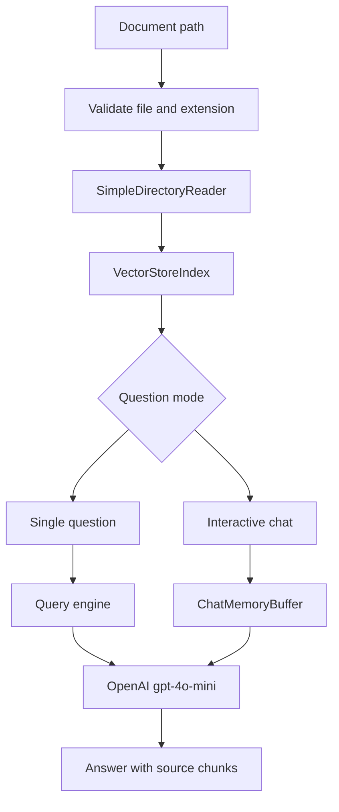
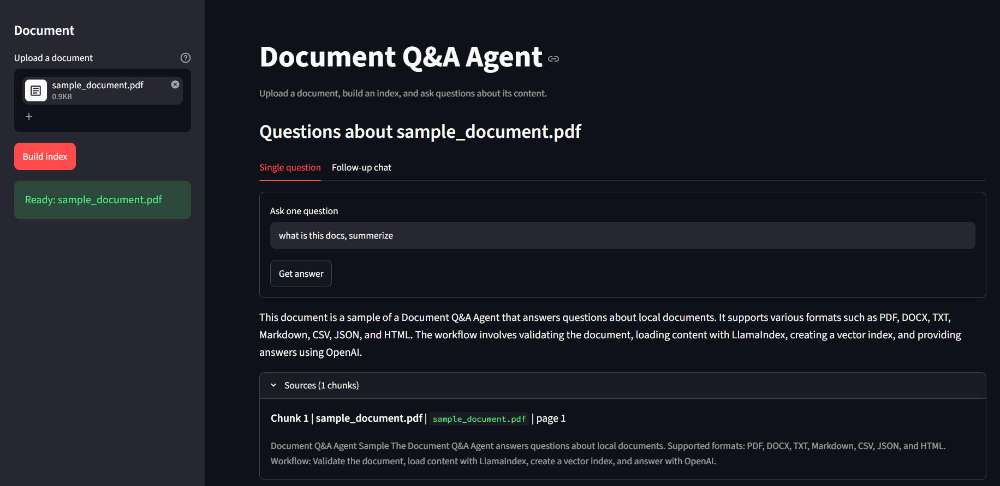

# Document Q&A Agent

A modular document question-answering agent built with LlamaIndex and OpenAI.
It loads a local document, creates a vector index, and answers questions from
that document.

## Where to put documents

Place documents you want to query in the `documents` folder:

```text
03_Document_QA_Agent/
├── documents/
│   └── samples/
│       ├── sample_document.csv
│       ├── sample_document.docx
│       ├── sample_document.html
│       ├── sample_document.json
│       ├── sample_document.md
│       ├── sample_document.pdf
│       └── sample_document.txt
├── agent.py
├── app.py
├── requirements.txt
└── explorations/
    └── notebook.ipynb
```

The repository includes matching sample files for every supported format in
`documents/samples`. Replace them or add your own files. Supported formats are:

- PDF: `.pdf`
- Word: `.docx`
- Text: `.txt`
- Markdown: `.md`
- CSV: `.csv`
- JSON: `.json`
- HTML: `.html`

The earlier names `notes.docx` and `report.txt` were examples. They only work
if those files actually exist in the current directory. Use the sample paths
below to test the included documents.

## Setup

Run these commands from Command Prompt inside `03_Document_QA_Agent`:

```cmd
python -m venv .venv
.venv\Scripts\activate.bat
pip install -r requirements.txt
copy .env.example .env
```

Add your OpenAI key to `.env`:

```env
OPENAI_API_KEY=your_openai_api_key_here
```

## Run the sample document

For one question:

```cmd
python agent.py --document documents\samples\sample_document.txt --question "What formats does the project support?"
```

For interactive Q&A:

```cmd
python agent.py --document documents\samples\sample_document.txt
```

Type questions at the `You:` prompt. Type `quit`, `exit`, or `q` to stop.

Examples with your own documents:

```cmd
python agent.py --document documents\samples\sample_document.docx --question "What is the purpose?"
python agent.py --document documents\samples\sample_document.pdf --question "What is the workflow?"
python agent.py --document documents\samples\sample_document.md --question "Summarize this document."
python agent.py --document documents\samples\sample_document.csv --question "What formats are supported?"
python agent.py --document documents\samples\sample_document.json --question "What is the purpose?"
python agent.py --document documents\samples\sample_document.html --question "What is the workflow?"
```

The old PDF command remains supported:

```cmd
python agent.py --pdf documents\samples\sample_document.pdf --question "What is the conclusion?"
```

## Architecture



## Code structure

- `validate_document_path()` checks existence and supported extensions.
- `build_index()` loads the file and creates the vector index.
- `single_question()` answers one question.
- `interactive_qa()` handles follow-up questions with chat memory.
- `main()` provides the command-line interface.

Runtime imports are deferred until indexing starts, so `--help` and local input
validation work even before LlamaIndex is installed.

## Error messages

`Document not found: ...` means the path is wrong or the file is not in the
current directory. Use a relative path such as `documents\report.txt`, or an
absolute path to a file elsewhere on your machine.

`Unsupported document type ...` means the extension is not one of the formats
listed above.

## Streamlit UI

The project also includes a browser UI for testing every supported format.
From Command Prompt in this folder:

```cmd
python -m streamlit run app.py
```

Open `http://localhost:8501`, upload a document in the sidebar, and select
**Build index**. The UI provides:

- Single-question answers with the number of referenced source chunks
- Follow-up chat with conversation memory
- Upload support for PDF, DOCX, TXT, Markdown, CSV, JSON, and HTML

The CLI and Streamlit UI both use the shared functions in `agent.py`, so they
follow the same loading, indexing, and retrieval behavior.

For each answer, the Streamlit UI shows source details instead of only a count:
the uploaded document name, title when available, page number for paginated
documents, chunk number, and a short text preview.

## UI Screenshot

The Streamlit interface supports document upload, index creation, single
questions, follow-up chat, and expandable source metadata.


