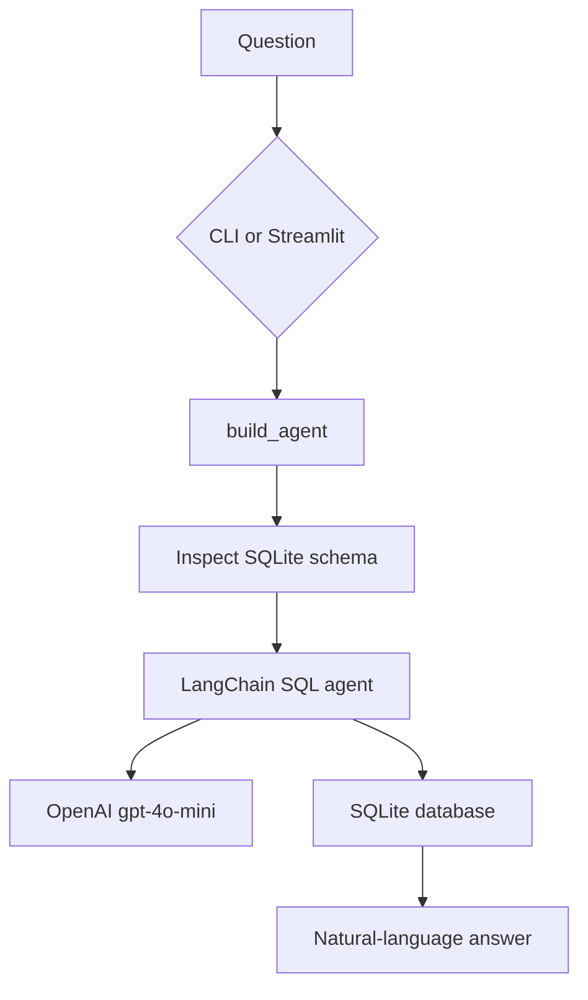
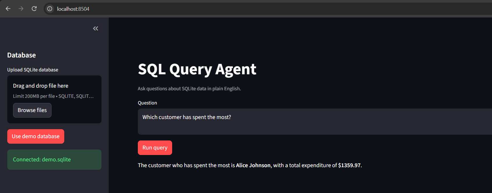

# SQL Query Agent

A small production-oriented agent that answers natural-language questions about
SQLite databases. It generates SQL with OpenAI, executes it through LangChain,
and returns the result in plain language.

## Features

- Demo e-commerce database created automatically
- Bring-your-own `.sqlite`, `.sqlite3`, or `.db` file
- Read-only access by default
- Explicit `--allow-write` opt-in for disposable databases
- CLI single-question and interactive modes
- Streamlit browser UI
- Modular functions with docstrings and clear validation

## Architecture



## Setup with Command Prompt

From this directory:

```cmd
python -m venv .venv
.venv\Scripts\activate.bat
copy .env.example .env
pip install -r requirements.txt
```

Add your OpenAI key to `.env`:

```env
OPENAI_API_KEY=your_openai_api_key_here
```

## CLI usage

Run the demo database:

```cmd
python agent.py
```

Ask one question against the demo database:

```cmd
python agent.py --question "What are the top 3 best-selling products?"
```

Use your own SQLite database:

```cmd
python agent.py --db data\sales.sqlite --question "What is total revenue by country?"
```

Interactive mode:

```cmd
python agent.py --db data\sales.sqlite
```

Type `quit`, `exit`, or `q` to stop.

## Streamlit UI

Start the browser interface:

```cmd
python -m streamlit run app.py
```

Open `http://localhost:8501`. Choose **Use demo database** or upload a SQLite
file, enter a question, and select **Run query**.

### UI screenshot

The Streamlit interface supports SQLite uploads, demo database connections,
natural-language questions, and formatted answers.



## Safety

The agent opens databases in read-only mode by default. This prevents the
normal workflow from mutating source data. Only use `--allow-write` with a
copy or disposable database, and only when write behavior is intentional.

The application does not accept arbitrary SQL from the user. The model creates
SQL using the database schema and the natural-language question, then executes
it through the LangChain SQL toolkit.

## Code structure

- `create_demo_database()` creates deterministic sample tables and data.
- `validate_database_path()` checks file existence and SQLite extensions.
- `sqlite_uri()` creates read-only or read-write SQLAlchemy URIs.
- `build_agent()` creates the LangChain SQL agent.
- `ask_database()` validates and executes one question.
- `main()` provides the CLI.
- `app.py` provides the Streamlit UI using the same agent builder.

LangChain imports are deferred until an agent is built, so `--help` and local
path validation remain available before optional dependencies are installed.

## Example questions

- How many customers are in each country?
- What are the top three products by revenue?
- What is total revenue by country?
- Which customer has spent the most?
- How many products are low in stock?
