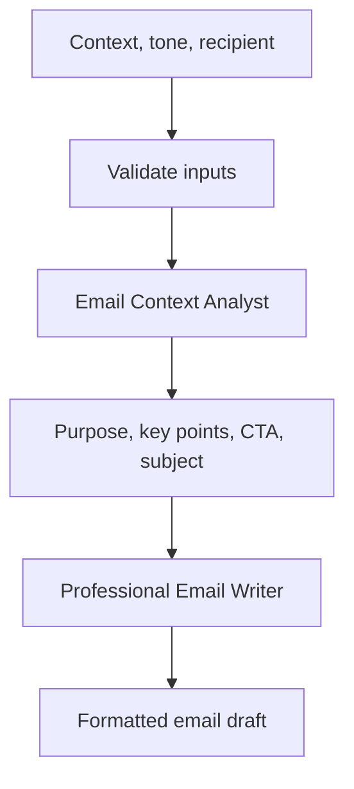
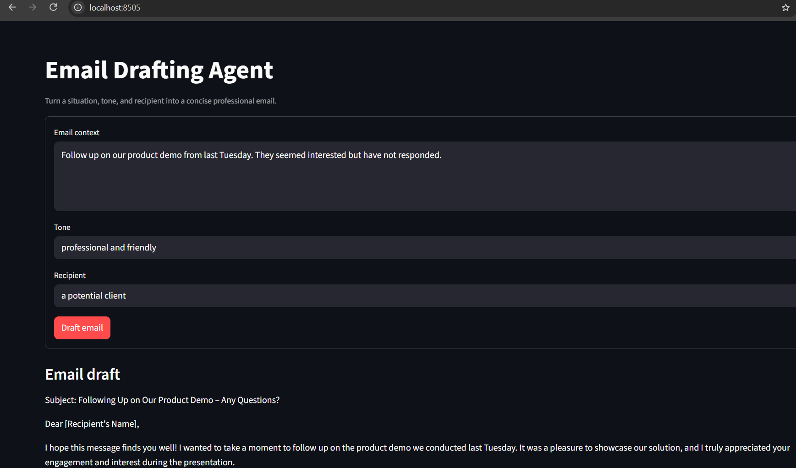
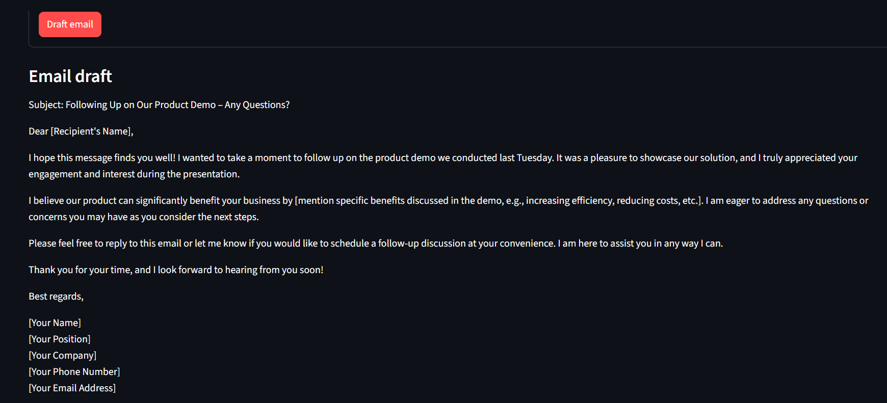

# Email Drafting Agent

A two-agent CrewAI workflow that turns an email situation into a concise,
professional draft. An analyst extracts the purpose and key points, then a
writer produces the final message.

## Architecture



The analyst task runs first. Its brief is passed to the writer task through
CrewAI task context. Both agents use `gpt-4o-mini` with deterministic low
randomness suitable for business writing.

## Features

- Context, tone, and recipient inputs
- Two-agent sequential workflow
- Input trimming and empty-value validation
- Context length limit of 10,000 characters
- CLI and Streamlit interfaces
- Concise body target under 200 words
- Reusable `draft_email()` function

## Setup with Command Prompt

From this directory:

```cmd
python -m venv .venv
.venv\Scripts\activate.bat
copy .env.example .env
pip install -r requirements.txt
```

Set your OpenAI key in `.env`:

```env
OPENAI_API_KEY=your_openai_api_key_here
```

## Run from the command line

Use the default example:

```cmd
python agent.py
```

Provide custom requirements:

```cmd
python agent.py --context "Follow up on the Q3 proposal sent last week" --tone "professional and confident" --recipient "the client project manager"
```

## Run the Streamlit UI

```cmd
python -m streamlit run app.py
```

Open `http://localhost:8501`, complete the context, tone, and recipient fields,
then select **Draft email**.

## Explore in the notebook

Open `explorations/notebook.ipynb` and run the cells from top to bottom. The
notebook demonstrates validation and crew construction before the final model
call.

## Code structure

- `validate_inputs()` normalizes and validates request data.
- `build_email_crew()` creates the analyst and writer agents.
- `draft_email()` runs the complete workflow and returns the draft.
- `main()` provides the CLI.
- `app.py` provides the Streamlit interface.

## Error handling

Empty context, tone, or recipient values are rejected before any API request.
Very large context strings are also rejected to keep prompts bounded. Runtime
errors are shown in the Streamlit interface and returned as CLI errors.

## Example output sections

A successful draft should include a subject line, greeting, concise body,
closing, and signature placeholder. Always review the generated email before
sending it, especially when it contains dates, prices, commitments, or private
information.

## UI Screenshots

### Email inputs and generated draft

The Streamlit interface accepts the email context, desired tone, and recipient,
then displays the generated draft.



### Generated email output

The final output includes a subject, greeting, concise body,
closing, and signature placeholders.



