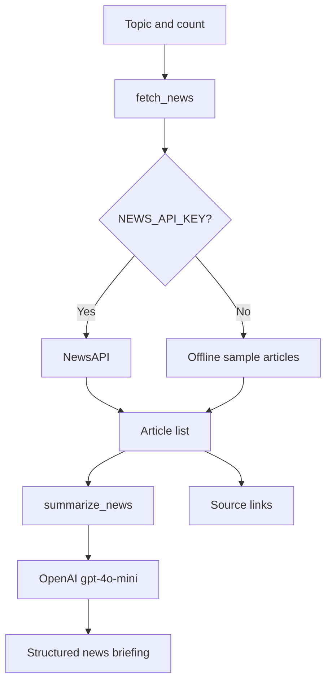

# News Summarizer Agent

A small news briefing agent that fetches articles for a topic and produces a
structured summary with key themes, watch items, headlines, and source links.

## Features

- NewsAPI integration for real articles
- Offline mock mode when `NEWS_API_KEY` is not configured
- OpenAI-powered structured briefing
- Topic and article-count validation
- CLI and Streamlit interfaces
- Expandable source list with publisher and article links
- HTTP timeout and API error handling

## Architecture



## Setup with Command Prompt

From this directory:

```cmd
python -m venv .venv
.venv\Scripts\activate.bat
copy .env.example .env
pip install -r requirements.txt
```

Required key:

```env
OPENAI_API_KEY=your_openai_api_key_here
```

Optional NewsAPI key:

```env
NEWS_API_KEY=your_newsapi_key_here
```

Without `NEWS_API_KEY`, the app runs with sample articles. OpenAI is still
required to generate the final briefing.

## CLI usage

```cmd
python agent.py --topic "artificial intelligence"
python agent.py --topic "climate change" --count 10
```

The article count must be between 1 and 20.

## Streamlit UI

```cmd
python -m streamlit run app.py
```

Open `http://localhost:8501`, enter a topic, choose the article count, and
select **Create briefing**. Expand **Sources** to inspect publishers and links.

## Notebook

Open `explorations/notebook.ipynb` and run cells from top to bottom. It shows
validation, offline article fetching, prompt input, and optional summarization.

## Code structure

- `validate_request()` normalizes and validates topic requests.
- `fetch_news()` retrieves NewsAPI data or deterministic mock data.
- `summarize_news()` creates the structured LLM briefing.
- `summarize_topic()` combines fetching and summarization.
- `app.py` provides the Streamlit interface.
- `main()` provides the CLI.

## Error handling

- Empty topics are rejected before network calls.
- Article counts outside 1-20 are rejected.
- NewsAPI HTTP and API-level errors are reported clearly.
- Empty article lists are rejected before an LLM request.
- Runtime UI errors are shown without exposing API keys.

Always verify important facts and links before publishing a generated briefing.
