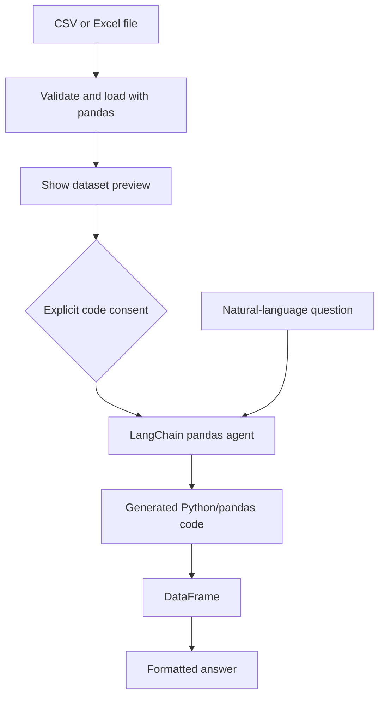
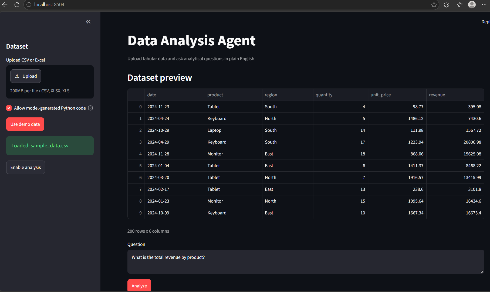
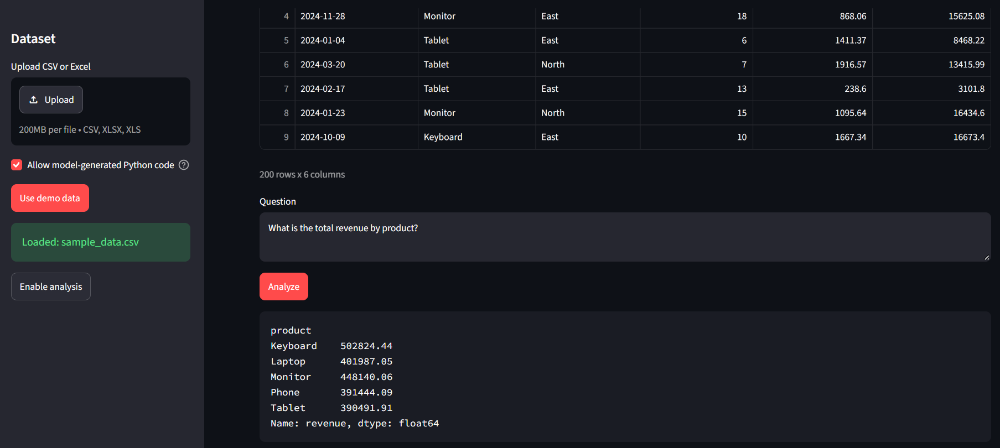

# Data Analysis Agent

A natural-language data analysis agent for CSV and Excel files. It uses pandas
and LangChain to generate analysis code, execute it locally, and explain the
result.

## Important safety note

The pandas agent executes model-generated Python code. This is powerful but
risky. Use it only with trusted prompts and non-sensitive local data. Analysis
requires an explicit `--allow-dangerous-code` CLI flag or a visible consent
checkbox in the Streamlit UI.

## Features

- CSV and Excel support
- Deterministic sample sales dataset
- Dataset preview before analysis
- Natural-language analytical questions
- CLI and Streamlit interfaces
- File existence, extension, empty-data, and row-count validation
- Explicit code-execution opt-in

## Architecture



### Processing flow

1. The user selects demo data or uploads a CSV/Excel file.
2. `validate_file_path()` checks the file type and existence.
3. `load_data()` reads the file with pandas and enforces the row limit.
4. The UI previews the first rows before analysis is enabled.
5. The user explicitly consents to model-generated Python execution.
6. `build_analyzer()` creates the LangChain pandas agent with `gpt-4o-mini`.
7. `ask_data()` sends a natural-language question to the analyzer.
8. The generated pandas result is rendered in the CLI or Streamlit UI.

### Module responsibilities

- `agent.py` contains the reusable data-loading, validation, analyzer, and CLI
    logic.
- `app.py` handles uploads, session state, preview rendering, consent, and
    interactive questions.
- `explorations/notebook.ipynb` demonstrates the underlying functions in small,
    independent cells before they are used by the application.

## Setup with Command Prompt

From this directory:

```cmd
python -m venv .venv
.venv\Scripts\activate.bat
copy .env.example .env
pip install -r requirements.txt
```

Set your OpenAI key in `.env`:

```env
OPENAI_API_KEY=your_openai_api_key_here
```

## CLI usage

Run the demo dataset:

```cmd
python agent.py --allow-dangerous-code
```

Ask one question:

```cmd
python agent.py --question "What is the total revenue by product?" --allow-dangerous-code
```

Analyze your own file:

```cmd
python agent.py --file data\sales.csv --question "Which region performs best?" --allow-dangerous-code
python agent.py --file data\sales.xlsx --question "What is the monthly revenue trend?" --allow-dangerous-code
```

Interactive mode:

```cmd
python agent.py --file data\sales.csv --allow-dangerous-code
```

Type `quit`, `exit`, or `q` to stop.

## Streamlit UI

```cmd
python -m streamlit run app.py
```

Open `http://localhost:8501`. Choose demo data or upload a CSV/Excel file. The
UI shows a preview, requires explicit generated-code consent, and then enables
natural-language analysis.

## Code structure

- `create_sample_data()` creates deterministic demo sales data.
- `validate_file_path()` validates file existence and extension.
- `load_data()` loads and bounds the dataset.
- `build_analyzer()` creates the pandas agent only after opt-in.
- `ask_data()` validates and executes one question.
- `app.py` provides the Streamlit interface.
- `main()` provides the CLI.

## Limits

- Supported extensions: `.csv`, `.xlsx`, `.xls`
- Maximum dataset size: 100,000 rows
- OpenAI API key required for analysis
- Generated code must be reviewed for sensitive or destructive operations

## Example questions

- What is the total revenue by product?
- Which region performs best?
- Show the correlation between quantity and revenue.
- What are the top five selling products?
- What is the monthly revenue trend?

## UI Screenshots

### Dataset upload and preview

The Streamlit UI loads demo or uploaded tabular data, displays a preview, and
requires explicit consent before enabling model-generated Python analysis.



### Natural-language analysis result

Users can ask questions such as total revenue by product and view the pandas
result directly in the application.


