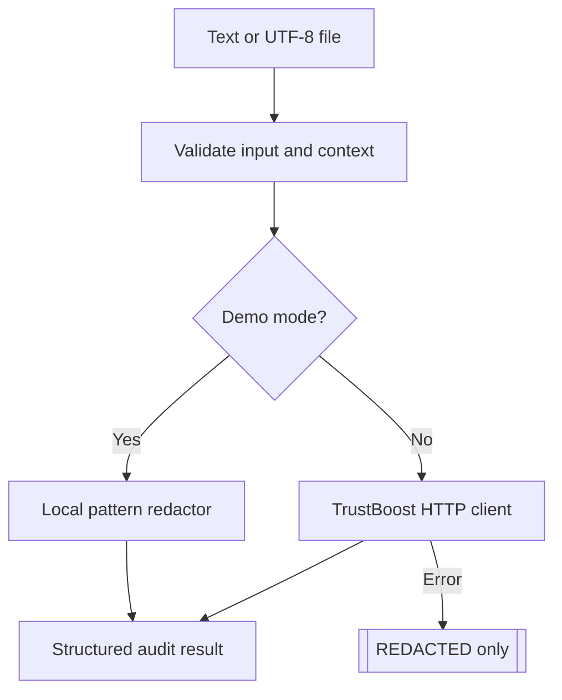
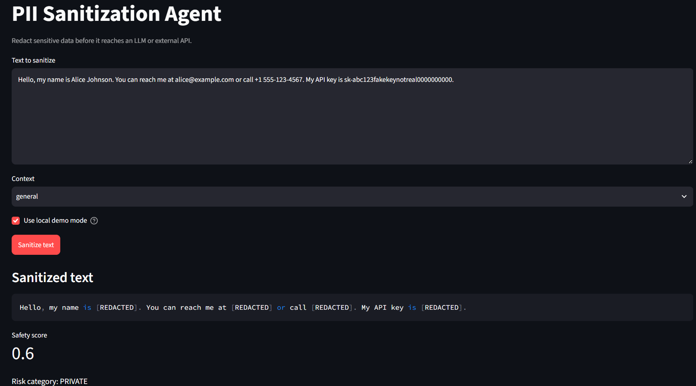
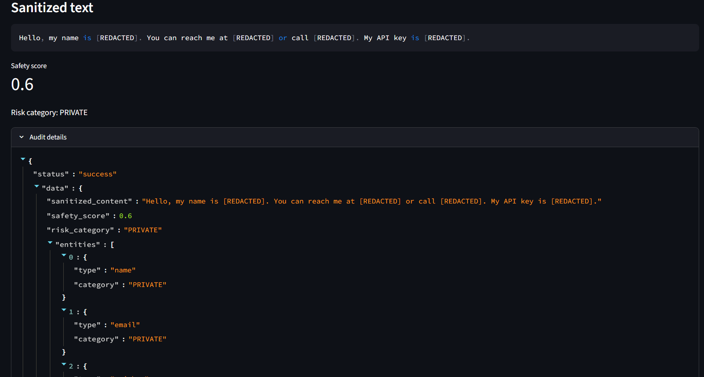

# PII Sanitization Agent

A fail-closed PII sanitization client for protecting text before it reaches an
LLM or external API. It supports a local demo mode and a configurable
TrustBoost API endpoint.

## Safety model

- Remote failures never return the original input.
- Missing remote configuration returns `[REDACTED]` with a failed status.
- Local demo mode redacts common emails, phones, and API-key patterns.
- Raw input is not logged or persisted by this client.
- Review the TrustBoost provider's retention and privacy terms before production
  use.

## Architecture



  ### Processing flow

  1. `validate_input()` checks text length and the selected context.
  2. Demo mode uses local pattern redaction for offline testing.
  3. Remote mode sends only the validated payload to the configured TrustBoost
    endpoint.
  4. `_parse_response()` normalizes the provider response into an auditable
    result.
  5. Any missing configuration, transport error, or invalid response returns a
    failed result containing `[REDACTED]`, never the original text.

  ### Module responsibilities

  - `agent.py` contains validation, local redaction, remote API handling, result
    normalization, file support, and the CLI.
  - `app.py` provides the Streamlit text sanitization and audit interface.
  - `explorations/notebook.ipynb` demonstrates the logic independently in small
    learner-friendly cells.

## Setup with Command Prompt

```cmd
python -m venv .venv
.venv\Scripts\activate.bat
copy .env.example .env
pip install -r requirements.txt
```

Configure the actual TrustBoost endpoint and credentials in `.env` according to
its current API documentation:

```env
TRUSTBOOST_API_URL=https://your-trustboost-endpoint.example/v1/sanitize
TRUSTBOOST_API_KEY=your_trustboost_api_key_here
TRUSTBOOST_WALLET=your_agent_wallet_here
```

The placeholder endpoint is intentional. Replace it with the verified endpoint
provided by TrustBoost before using remote mode.

## CLI usage

Safe offline demo mode:

```cmd
python agent.py --demo --text "Email a@b.com or call 555-123-4567"
```

Remote text sanitization:

```cmd
python agent.py --text "Email a@b.com" --context general
```

Sanitize a file:

```cmd
python agent.py --demo --file input.txt --context legal
```

Contexts: `general`, `financial`, `legal`, `medical`, and `code`.

## Streamlit UI

```cmd
python -m streamlit run app.py
```

The UI supports local demo mode by default. Disable demo mode only after
configuring and verifying the TrustBoost endpoint.

## Notebook

Open `explorations/notebook.ipynb` and run the small cells in order. It explores
validation, local redaction, response normalization, and fail-closed behavior
without importing the production module.

## Result shape

```json
{
  "status": "success",
  "data": {
    "sanitized_content": "Contact [REDACTED]",
    "safety_score": 0.6,
    "risk_category": "PRIVATE",
    "entities": [{"type": "email", "category": "PRIVATE"}],
    "tx_hash": "LOCAL_DEMO"
  },
  "error": null
}

## UI Screenshots

### Input and sanitization

The Streamlit UI accepts text, a sanitization context, and local demo-mode
selection before showing the redacted result.



### Audit details

The audit panel shows the safety score, risk category, detected entity types,
and sanitization status without exposing the original PII.


```
