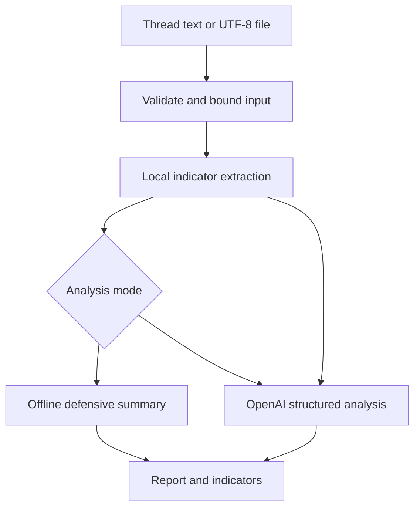
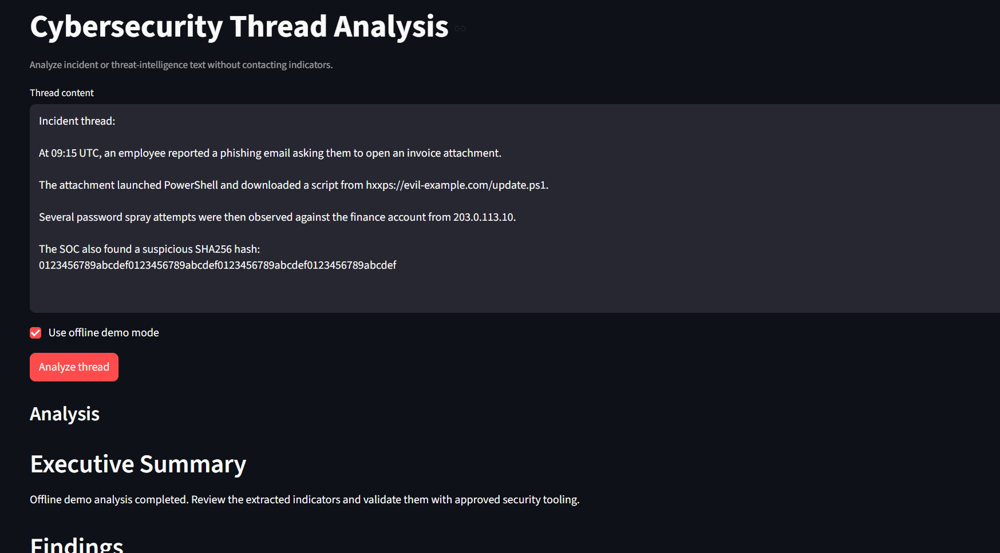
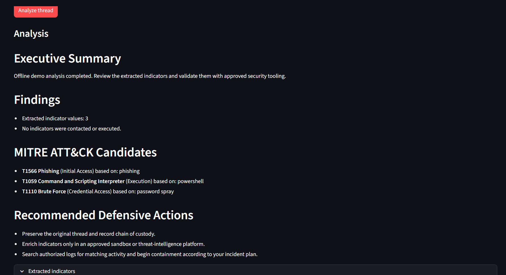
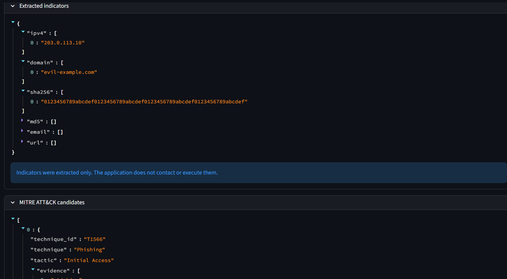
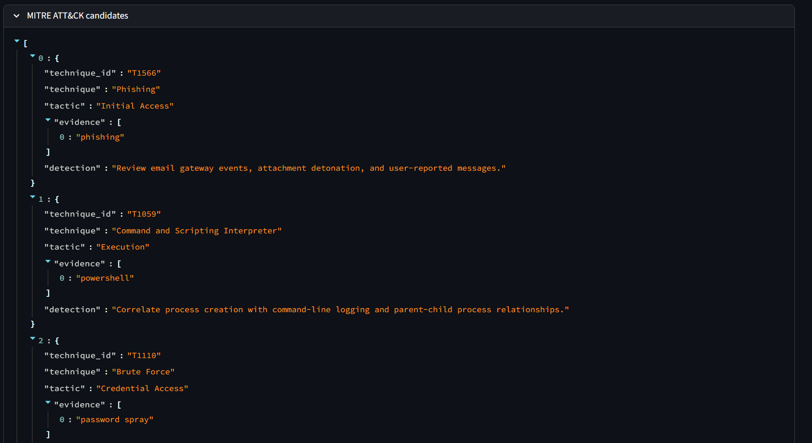

# Cybersecurity Thread Analysis Agent

A defensive agent for analyzing incident-response and threat-intelligence
threads. It extracts indicators locally and produces a structured report with
severity, timeline, findings, MITRE ATT&CK references when supported, and
recommended defensive actions.

## Safety boundary

This tool does not execute commands, resolve domains, visit URLs, or contact
indicators. It is an analysis and triage aid. Validate findings with approved
security tooling and follow your incident-response process.

## Architecture



### MITRE ATT&CK mapping

The local analysis stage maps explicit language to conservative ATT&CK
candidates before any model call. Each candidate includes:

- Technique ID and name, such as `T1566 Phishing` or `T1059 Command and
  Scripting Interpreter`
- ATT&CK tactic
- Evidence phrases found in the thread
- A defensive telemetry suggestion

These are candidates, not confirmed findings. Analysts should validate them
against authoritative MITRE ATT&CK content and available telemetry. The design
follows the reference project's threat-hunting emphasis on detection rules,
datasets, endpoint/network visibility, and ATT&CK-mapped analytics.

References:

- [MITRE ATT&CK](https://attack.mitre.org/)
- [Awesome Threat Detection and Hunting](https://github.com/0x4D31/awesome-threat-detection)

### What is MITRE ATT&CK?

[MITRE ATT&CK](https://attack.mitre.org/) is a knowledge base of documented
adversary behaviors. It organizes activity into:

- **Tactics**: the adversary's goal, such as Initial Access, Execution, or
  Credential Access.
- **Techniques**: the behavior used to achieve that goal, such as Phishing
  (`T1566`), Command and Scripting Interpreter (`T1059`), or Brute Force
  (`T1110`).
- **Sub-techniques**: more specific forms of a technique, such as PowerShell
  (`T1059.001`).

This agent uses ATT&CK as a common language for defensive triage. It scans the
thread for explicit behavior terms, attaches matching technique IDs and
tactics, and suggests relevant telemetry to review. These mappings are
**candidates**, not proof that an attack occurred. A security analyst should
validate the evidence against authoritative ATT&CK descriptions, logs, and the
organization's detection rules before taking action.

## Setup with Command Prompt

```cmd
python -m venv .venv
.venv\Scripts\activate.bat
copy .env.example .env
pip install -r requirements.txt
```

Set `OPENAI_API_KEY` in `.env` for model analysis.

## CLI usage

Safe offline demo:

```cmd
python agent.py --demo --text "Suspicious login from 203.0.113.10 to evil.example.com"
```

Analyze a thread with OpenAI:

```cmd
python agent.py --text "Paste the incident thread here"
```

Analyze a UTF-8 file:

```cmd
python agent.py --demo --file incident_thread.txt
```

## Streamlit UI

```cmd
python -m streamlit run app.py
```

Open `http://localhost:8501`. Paste a thread, choose offline demo mode or model
analysis, and select **Analyze thread**. Expand the indicator panel to inspect
extracted IPs, domains, URLs, hashes, and emails.

## Code structure

- `validate_thread()` bounds and validates input.
- `extract_indicators()` extracts common indicators without contacting them.
- `map_mitre_attack()` maps explicit evidence to ATT&CK technique candidates.
- `build_analysis_messages()` prepares model evidence.
- `analyze_thread()` runs demo or OpenAI analysis.
- `app.py` provides the Streamlit interface.

## Limitations

- Local extraction is intentionally conservative and is not a replacement for
  a full IOC parser.
- Model output must be reviewed by a qualified analyst.
- The OpenAI mode requires an API key and may incur usage costs.
- Do not paste secrets or regulated data into third-party services without
  appropriate authorization.

## UI Screenshots

### Thread input and offline analysis



### Defensive findings and ATT&CK candidates



### Extracted indicators



### MITRE ATT&CK evidence mapping


