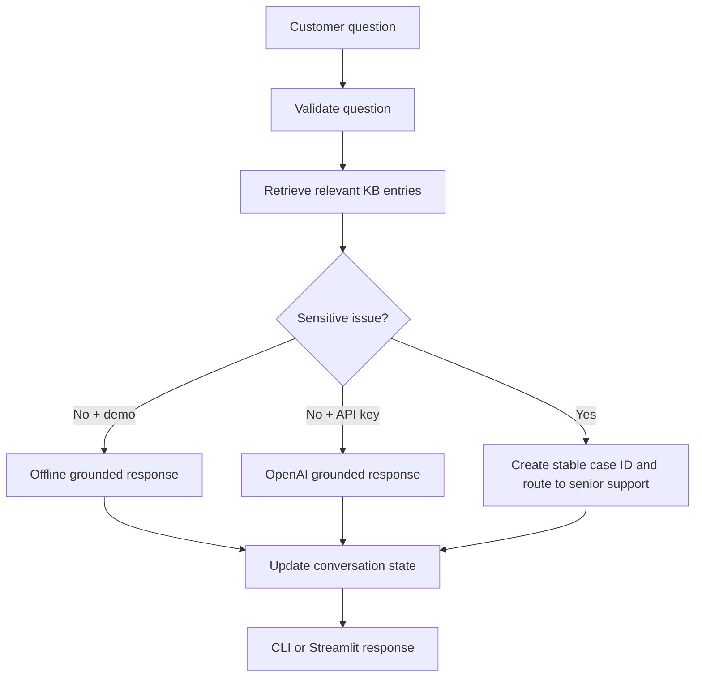
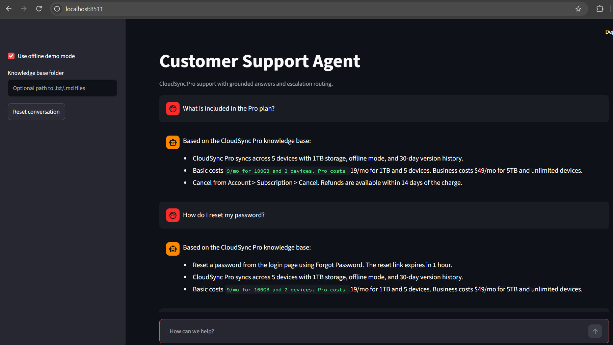

# Customer Support Agent

A grounded CloudSync Pro support agent with local knowledge-base retrieval,
conversation history, and deterministic escalation routing for sensitive issues.

## Features

- Offline demo mode without API calls
- Optional OpenAI answers grounded in the knowledge base
- `.txt` and `.md` knowledge-base loading
- Explicit conversation state and reset support
- Escalation for refunds, fraud, billing disputes, lawsuits, account takeover,
  and data loss
- CLI and Streamlit interfaces
- Stable case IDs for escalated requests

## Architecture



### Design decisions

- Retrieval is explicit and bounded to the most relevant local entries.
- Escalation is checked before an LLM call for predictable sensitive-case
  routing.
- Demo mode is safe for local testing and does not require credentials.
- OpenAI mode receives knowledge-base context and recent conversation history.
- No tools, payments, account changes, or external actions are performed.

## Setup with Command Prompt

```cmd
python -m venv .venv
.venv\Scripts\activate.bat
pip install -r requirements.txt
```

For OpenAI mode, configure `OPENAI_API_KEY` in `.env`. Demo mode does not need
an API key.

## CLI usage

Start offline support:

```cmd
python agent.py --demo
```

Use OpenAI-backed support:

```cmd
python agent.py
```

Load custom knowledge-base files:

```cmd
python agent.py --demo --kb-dir docs
```

The folder may contain UTF-8 `.txt` and `.md` files.

## Streamlit UI

```cmd
python -m streamlit run app.py
```

The UI supports chat history, offline demo mode, optional custom knowledge-base
folders, visible escalation status, and conversation reset.

## Example questions

```text
What is included in the Pro plan?
How do I reset my password?
Which platforms are supported?
I was charged incorrectly and want a refund.
I suspect an account takeover.
```

## Code structure

- `SupportState` stores history, retrieved context, and the last response.
- `SupportService.retrieve()` performs local knowledge-base retrieval.
- `SupportService.should_escalate()` routes sensitive requests.
- `SupportService.respond()` coordinates one support turn.
- `SupportService.llm_answer()` handles optional OpenAI generation.
- `app.py` provides the Streamlit chat UI.
- `explorations/notebook.ipynb` demonstrates the functions independently.

## Safety and limitations

- This agent is not a billing, legal, or security system of record.
- Escalation keywords are a conservative first-pass rule and need review.
- Model answers must remain grounded and should be reviewed for high-impact
  decisions.
- Do not put secrets or payment credentials in the knowledge base or prompts.

## UI Screenshot

The Streamlit interface shows offline mode, grounded knowledge-base answers,
conversation history, and follow-up questions.


