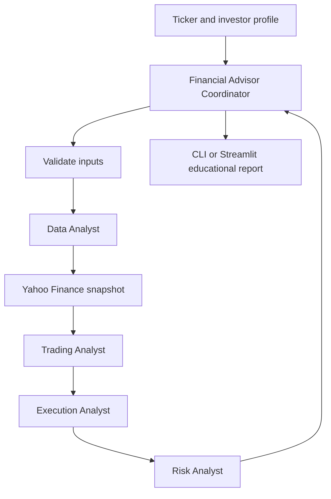
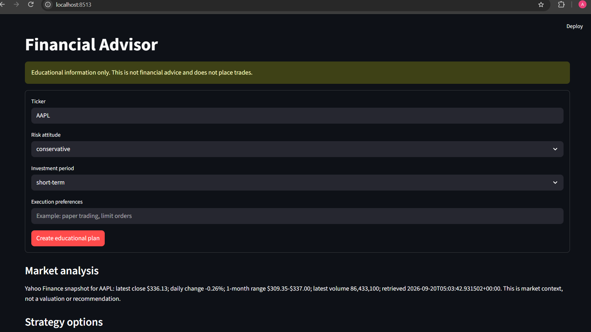
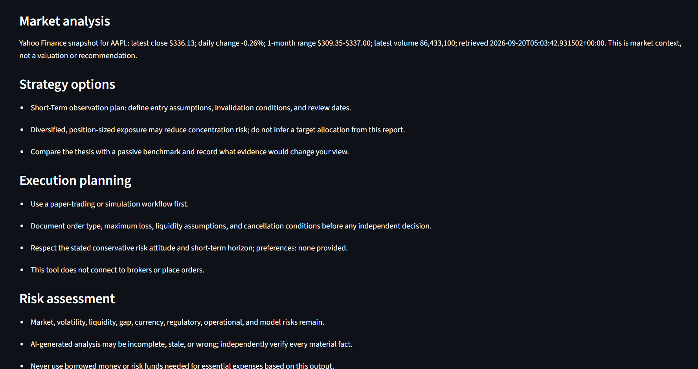

# Educational Financial Advisor

A local, risk-aware planning assistant that reads recent Yahoo Finance market
data and creates educational market-research and portfolio-planning templates.
It does not place orders, connect to brokers, or provide personalized financial
advice.

## Architecture



### Agent responsibilities

1. **Financial Advisor Coordinator** validates the request and combines the
  role outputs into one educational report.
2. **Data Analyst** gathers and summarizes read-only market context from
  Yahoo Finance, including freshness and source information.
3. **Trading Analyst** turns the available evidence into scenario-based,
  non-personalized strategy options and states assumptions.
4. **Execution Analyst** creates a paper-trading checklist covering order
  assumptions, liquidity, slippage, review timing, and cancellation conditions.
5. **Risk Analyst** evaluates market, liquidity, operational, model,
  concentration, and behavioral risks against the requested profile.

All role prompts are stored under `subagent/`. The current local implementation
uses deterministic report generation; the role modules provide clean prompt and
metadata boundaries for a future ADK coordinator.

## Data source and safety

Market context is fetched read-only through `yfinance`, using Yahoo Finance
recent daily history. The report shows the latest close, daily change, recent
one-month range, volume, retrieval timestamp, and source. Yahoo Finance data
can be delayed, incomplete, or unavailable; the app reports failures instead of
inventing values.

The original Google ADK cloud entry point remains separate and optional. The
local app does not connect to brokers or place trades.

## Setup with Command Prompt

```cmd
python -m venv .venv
.venv\Scripts\activate.bat
pip install -r requirements.txt
```

Install the dependencies from `requirements.txt`. The local educational
workflow itself does not require an API key, while the optional Google ADK/A2A
deployment entry point requires its corresponding cloud configuration.

## CLI usage

```cmd
python agent.py --ticker AAPL --risk balanced --period long-term
```

Optional execution preferences:

```cmd
python agent.py --ticker MSFT --risk conservative --period medium-term --preferences "paper trading; limit orders"
```

## Streamlit UI

```cmd
python -m streamlit run app.py --server.port 8512
```

The UI displays the disclaimer before the report and clearly separates market
research checklists, strategy options, execution planning, and risks.

## Exploration notebook

Open `explorations/notebook.ipynb` and run the cells from top to bottom. Each
function is introduced in its own small cell and tested in a following cell:

1. Allowed risk and investment-period values
2. Request validation
3. Read-only Yahoo Finance snapshot retrieval
4. Educational report generation

The notebook is independent of `agent.py` so learners can understand the
workflow before reading the production entry point.

## Safety boundaries

- Output is educational and not a buy/sell recommendation.
- Market data comes from Yahoo Finance and should be independently verified.
- No broker, wallet, exchange, or order API is called.
- Execution planning is limited to paper-trading and documentation checklists.
- Verify all facts with authoritative sources and consult a qualified adviser.

## Code structure

- `validate_request()` validates ticker and investor-profile inputs.
- `create_report()` creates the transparent educational report.
- `plan_financial_request()` is the reusable service boundary.
- `app.py` provides the Streamlit UI.
- `subagent/data_analyst/` defines the market-data role and prompt.
- `subagent/trading_analyst/` defines the strategy role and prompt.
- `subagent/execution_analyst/` defines the paper-execution role and prompt.
- `subagent/risk_analyst/` defines the risk-assessment role and prompt.
- `fastapi_api_app.py` is an optional Google ADK deployment template. It is not
  part of the verified local workflow and requires the original cloud package
  layout (`financial_advisor.app_utils`) plus Google Cloud credentials.

## Production status

The local CLI and Streamlit app are runnable and validated with read-only market
data. Before deploying to production, add provider monitoring, rate limits,
tests for Yahoo Finance failures, authentication, audit logging, and a formal
human-review process. Never enable automated order execution from this project.

## UI Screenshots

### Advisor inputs and live market snapshot



### Educational plan and risk assessment


