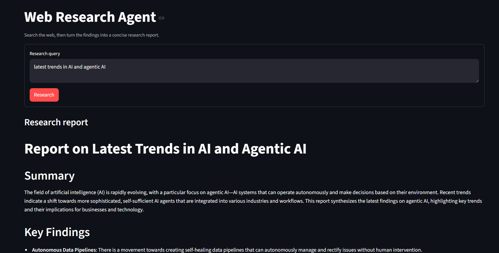
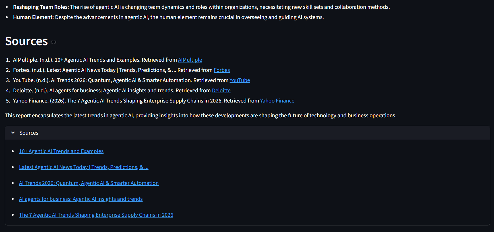
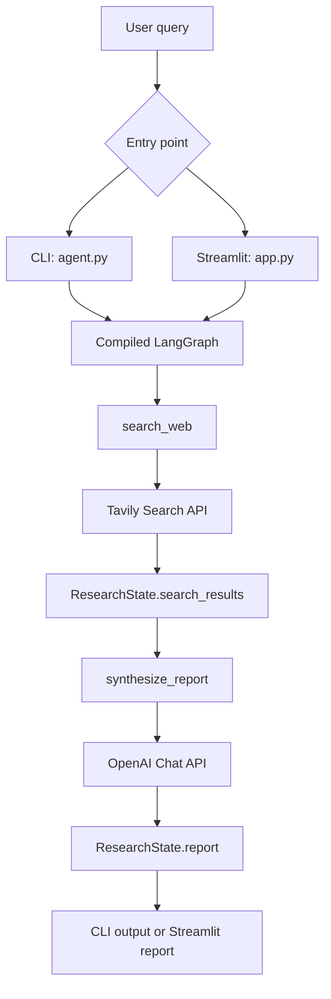

# Web Research Agent

A small web research agent that searches the internet with Tavily, sends the
findings to an OpenAI model, and displays a structured research report. It can
be used from the command line or through a Streamlit web interface.

## Features

- Accepts a natural-language research query.
- Searches Tavily for up to five relevant results.
- Includes source URLs, titles, and short content excerpts in the LLM prompt.
- Generates a report with a summary, key findings, and sources.
- Displays the report and clickable source links in Streamlit.
- Reuses the compiled LangGraph workflow between Streamlit reruns.

## Screenshots

### Research query and generated report

The Streamlit interface provides a prefilled research query, a Research button,
and the generated report with its summary and key findings.



### Findings and sources

The report includes synthesized findings, cited source references, and an
expandable Sources section containing links returned by Tavily.



## Architecture

The application has two layers:

1. **Research workflow**: `agent.py` owns the research state and LangGraph
	nodes. It is shared by both the CLI and Streamlit entry points.
2. **User interfaces**: `agent.py` provides the CLI, while `app.py` provides
	the browser-based Streamlit interface.



### Workflow

The graph runs in a fixed sequence:

1. The UI or CLI creates an initial `ResearchState` containing the query and
	empty result fields.
2. `search_web` calls Tavily with `max_results=5`.
3. The search response is normalized into a list of result dictionaries. This
	handles both dictionary and list response formats.
4. `synthesize_report` limits each result excerpt to 500 characters and builds
	a system message plus a user message for the OpenAI model.
5. `gpt-4o-mini` generates the final report.
6. The result is returned to the caller. Streamlit also exposes the returned
	source URLs in an expandable Sources section.

### Shared state

`ResearchState` is the contract between the graph nodes:

| Field | Purpose |
| --- | --- |
| `query` | The user's research question. |
| `search_results` | Normalized Tavily results. |
| `report` | The generated research report. |
| `messages` | LangGraph-managed conversation messages. |

## Project structure

```text
.
├── README.md
└── web_search_agent/
	 ├── agent.py          # ResearchState, graph nodes, graph builder, CLI
	 ├── app.py            # Streamlit user interface
	 └── requirements.txt  # Python dependencies
```

## Requirements

- Python 3.10 or newer
- An OpenAI API key
- A Tavily API key

The application loads environment variables with `python-dotenv`. Create a
`.env` file in the project root:

```env
OPENAI_API_KEY=your-openai-api-key
TAVILY_API_KEY=your-tavily-api-key
```

Do not commit `.env` or expose either key in source control.

## Installation

From the project root, create and activate a virtual environment, then install
the dependencies:

```powershell
python -m venv .venv
.\.venv\Scripts\Activate.ps1
pip install -r web_search_agent\requirements.txt
```

If PowerShell blocks activation, run the application with the Python executable
inside `.venv` directly or adjust the local execution policy for your user.

## Run the Streamlit UI

```powershell
python -m streamlit run web_search_agent\app.py
```

Open `http://localhost:8501` in a browser. The initial screen contains a
prefilled example query. Enter a question and select **Research**. While the
workflow runs, the UI shows a spinner; after completion it renders the report
and an expandable list of source links.

## Run from the command line

From the project root:

```powershell
python web_search_agent\agent.py --query "latest trends in AI and agentic AI"
```

Or change into the package directory first:

```powershell
cd web_search_agent
python agent.py --query "latest trends in AI and agentic AI"
```

If no query is supplied, the CLI uses its built-in default query.

## Error handling

- Empty Streamlit queries are rejected before an API call is made.
- Runtime errors from the research workflow are shown as a Streamlit error
  message.
- Unexpected Tavily response shapes are converted to an empty result list so
  the synthesis node always receives a predictable field.
- API credentials must be available before submitting a query.

## Current limitations

- The workflow is sequential: search completes before synthesis begins.
- Results are not persisted between application sessions.
- The report depends on the quality and availability of Tavily and OpenAI.
- There is no authentication or multi-user storage layer.